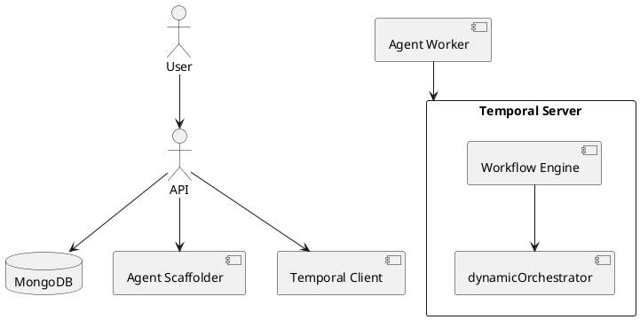

# 🏛 Architecture Overview

## 🧠 Overview

This project is a modular, multi-agent orchestration framework that allows LLM-based or external agents to collaborate through Temporal workflows.

## 🧱 Components

- **Temporal Workflows**: core orchestrator (`dynamicOrchestrator`)
- **Agents**: each agent has its own worker and `activities.ts`
- **MongoDB**: stores flow definitions and agent configs
- **Express API**: used to register agents and start flows
- **Next.js UI**: visual drag-and-drop flow builder
- **Docker Compose**: dev environment with Temporal, Mongo, workers

## 📊 Diagram

## 📦 Deployment Targets

- Agent workers can run:
  - Locally (Docker)
  - On Kubernetes
  - As AWS Lambda (future support)